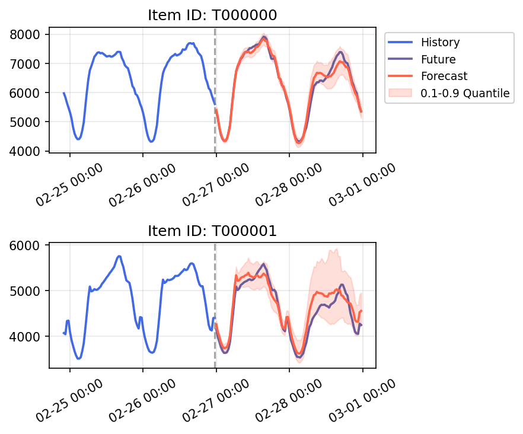
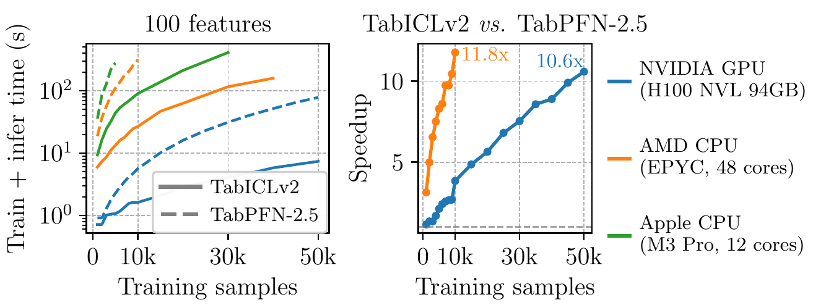

[](https://github.com/soda-inria/tabicl/actions/workflows/testing.yml)
[](https://badge.fury.io/py/tabicl)
[](https://pypistats.org/packages/tabicl)

# TabICLv2: A state-of-the-art tabular foundation model

This repository is the official implementation of **TabICLv2** ([arXiv](https://arxiv.org/abs/2602.11139)) 
and **TabICL** ([ICML 2025](https://arxiv.org/abs/2502.05564)).

**State-of-the-art accuracy even without hyperparameter tuning:** 
TabICLv2 is the new state-of-the-art model for tabular classification and regression 
on the [TabArena](https://tabarena.ai) and [TALENT](https://arxiv.org/abs/2407.00956) benchmarks. 
It does not require hyperparameter tuning 
and still outperforms heavily tuned XGBoost, CatBoost, or LightGBM on TabArena on ~80% of datasets.

**Easy to use:** TabICL is pip-installable and scikit-learn compliant. 
It is also **open source** (including [pre-training](#pre-training) for v1), 
with a permissive license.

**Speed:** TabICL performs `fit` and `predict` jointly via a single 
forward pass through a pre-trained transformer model. 
For larger datasets, we recommend a GPU.
On an H100 GPU, TabIClv2 can `fit` and `predict` a dataset 
with 50,000 samples and 100 features in under 10 seconds, 
which is 10x faster than TabPFN-2.5.
Through KV caching, TabICL supports faster repeated inference on the same training data.

**Scalability:** TabICL shows excellent performance on benchmarks 
with 300 to 100,000 training samples and up to 2,000 features. 
It can scale to even larger datasets (e.g., 500K samples) through CPU and disk offloading, 
though its accuracy may degrade at some point.


## Installation

```bash
pip install tabicl
```

Optional dependencies can be installed as needed:
```bash
pip install tabicl[forecast]   # time series forecasting
pip install tabicl[pretrain]   # pre-training
pip install tabicl[all]        # everything
```

## Basic usage

```python
from tabicl import TabICLClassifier, TabICLRegressor

clf = TabICLClassifier()
clf.fit(X_train, y_train)  # downloads checkpoint on first use, otherwise cheap
clf.predict(X_test)  # in-context learning happens here

reg = TabICLRegressor()
reg.fit(X_train, y_train)
reg.predict(X_test)
```

To speed up repeated inference on the same training data, enable KV caching during `fit`. Note that this consumes additional memory to store the cached projections, so consider the trade-off
for your use case:

```python
clf.fit(X_train, y_train, kv_cache=True)  # caches key-value projections for training data
clf.predict(X_test)  # fast: only processes test data by reusing the cached context
```

Save and load a fitted classifier or regressor:

```python
clf.save(
    "classifier.pkl",
    save_model_weights=False,  # if False, reload from checkpoint on load
    save_training_data=True,   # if True, include training data; if False, discard it (requires KV cache)
    save_kv_cache=True,        # if True and KV cache exists, save it
)
clf = TabICLClassifier.load("classifier.pkl")
```

When KV cache exists and is saved, you can set `save_training_data=False` to exclude
cached training data, which may be useful for data privacy.

## Advanced configuration

TabICL offers a set of parameters to customize its behavior. The following example shows all available parameters with their default values and brief descriptions:

```python
from tabicl import TabICLClassifier

clf = TabICLClassifier(
    n_estimators=8,  # number of ensemble members, more = better but slower
    norm_methods=None,  # normalization methods to try
    feat_shuffle_method="latin",  # feature permutation strategy
    class_shuffle_method="shift",  # class permutation strategy
    outlier_threshold=4.0,  # z-score threshold for outlier detection and clipping
    softmax_temperature=0.9,  # temperature to control prediction confidence
    average_logits=True,  # average logits (True) or probabilities (False)
    support_many_classes=True,  # handle >10 classes automatically
    batch_size=8,  # ensemble members processed together, lower to save memory
    model_path=None,  # path to checkpoint, None downloads from Hugging Face
    allow_auto_download=True,  # auto-download checkpoint if not found locally
    checkpoint_version="tabicl-classifier-v2-20260212.ckpt",  # pretrained checkpoint version
    device=None,  # inference device, None auto-selects CUDA or CPU
    use_amp="auto",  # automatic mixed precision for faster inference
    use_fa3="auto",  # Flash Attention 3 for Hopper GPUs (e.g. H100)
    offload_mode="auto",  # automatically decide when to use cpu/disk offloading
    disk_offload_dir=None,  # directory for disk offloading
    random_state=42,  # random seed for reproducibility
    n_jobs=None,  # number of PyTorch threads for CPU inference
    verbose=False,  # print detailed information during inference
    inference_config=None,  # fine-grained inference control for advanced users
)
```

`TabICLRegressor` accepts the same parameters except for the classification-specific ones:
`class_shuffle_method`, `softmax_temperature`, `average_logits`, and `support_many_classes`.

## Available models

| Model | Classification checkpoint | Regression checkpoint |
|-------|--------------------------|----------------------|
| **TabICLv2** ([arXiv](https://arxiv.org/abs/2602.11139)) | `tabicl-classifier-v2-20260212.ckpt` (default) | `tabicl-regressor-v2-20260212.ckpt` (default) |
| **TabICLv1.1** (May 2025, no paper) | `tabicl-classifier-v1.1-20250506.ckpt` | — |
| **TabICLv1** ([ICML 2025](https://arxiv.org/abs/2502.05564)) | `tabicl-classifier-v1-20250208.ckpt` | — |

- **TabICLv2**: Our state-of-the-art model, supporting both classification and regression.
  Strongly improved accuracy over v1 through better synthetic pre-training data,
  architectural improvements, and better pre-training, with comparable runtime.
- **TabICLv1.1**: TabICLv1 post-trained on an early version of the v2 prior. Classification only.
- **TabICLv1**: Original model. Classification only.
  TabICLv1 and v1.1 originally used `n_estimators=32`; we reduced the default to 8 afterwards.

## Time series forecasting

TabICL can be used for zero-shot time series forecasting via `TabICLForecaster`.
Install the forecast dependencies first:

```bash
pip install tabicl[forecast]
```

The following example shows how it works for univariate forecasting:

```python
import pandas as pd
from tabicl import TabICLForecaster
from tabicl.forecast import TimeSeriesDataFrame, plot_forecast

df = pd.read_csv(
    "https://autogluon.s3.amazonaws.com/datasets/timeseries/australian_electricity_subset/test.csv",
    parse_dates=["timestamp"],
)
data = TimeSeriesDataFrame.from_data_frame(df)

prediction_length = 96
selected_items = data.item_ids[:2]
train_data, test_data = data.train_test_split(prediction_length)

context_df = train_data.reset_index()
context_df = context_df[context_df["item_id"].isin(selected_items)]
test_df = test_data.reset_index()
test_df = test_df[test_df["item_id"].isin(selected_items)]
test_df = test_df.groupby("item_id").tail(prediction_length)

forecaster = TabICLForecaster(max_context_length=10240)
pred_df = forecaster.predict_df(context_df, prediction_length=prediction_length)
fig, axes = plot_forecast(context_df=context_df, pred_df=pred_df, test_df=test_df)
```




`TabICLForecaster` is heavily inspired by [TabPFN-TS](https://arxiv.org/abs/2501.02945v3),
and most of the code is directly copied from [tabpfn-time-series](https://github.com/PriorLabs/tabpfn-time-series).
We may later improve it to enhance the ability of TabICL for time series forecasting.

## Pre-training

Pre-training code (including synthetic data generation) is currently available for the v1 model. 
The scripts folder provides the commands for [stage 1](./scripts/train_stage1.sh), [stage 2](./scripts/train_stage2.sh), 
and [stage 3](./scripts/train_stage3.sh) of curriculum learning.
Pre-training code for v2 will be released upon publication.

## Nanotabicl: a minimal architecture implementation

We provide a minimal implementation of the TabICLv2 architecture 
[here](https://github.com/soda-inria/nanotabicl), 
for educational and experimental purposes.

## FAQ

**What is TabICL?**
TabICL is a tabular foundation model (like TabPFN). 
It uses in-context learning (ICL) to learn from new data 
in a single forward pass through a Transformer model: 
`y_pred = model(X_train, y_train, X_test)` (this is called inside `predict()`).
It has acquired strong learning capabilities through 
pre-training on millions of synthetic datasets.

**How fast is TabICL?** On datasets with $n$ training rows and $m$ columns, 
the runtime complexity of TabICL (v1 and v2) is $O(n^2 + nm^2)$. 
On datasets with many rows and columns, it can be 10x faster than TabPFN-2.5. 
On modern GPUs, TabICL can handle a million samples 
in a few minutes without RAM overflow
thanks to CPU and disk offloading.



**What dataset sizes work well?** 
TabICLv2 is pre-trained on datasets between 300 and 48K training samples.
However, it can generalize to larger datasets to some extent, 
and we see good results even on some datasets with 600K samples. 
We have not tested if TabICL generalizes to datasets smaller than 300 samples.


**What about the number of columns?**
TabICLv2 is pre-trained on datasets between 2 and 100 columns. 
We see good generalization to more columns and don't know where the limit is.


<!--
## Memory-Efficient Inference

TabICL includes memory management to handle large datasets:

- **Memory Profiling**: Built-in memory estimators for different components of the model
- **Batch Size Estimation**: Dynamically determines optimal batch sizes based on available GPU memory
- **CPU and disk Offloading**: Automatically offloads intermediate results to CPU and/or disk when beneficial
- **OOM Recovery**: Recovers gracefully from out-of-memory errors by reducing batch size
-->

## Preprocessing

### Simple built-in preprocessing
If the input `X` to TabICL is a pandas DataFrame, TabICL will automatically:
- Detect and ordinal encode categorical columns (including string, object, category, and boolean types)
- Create a separate category for missing values in categorical features
- Perform mean imputation for missing numerical values (encoded as NaN)

If the input `X` is a numpy array, TabICL assumes that ordinal encoding and missing value imputation have already been performed.

For both input types, TabICL applies additional preprocessing:
- Outlier detection and removal
- Feature scaling and normalization
- Feature shuffling for ensemble diversity

### Advanced data preprocessing with skrub 

Real-world datasets often contain complex heterogeneous data that benefits from more sophisticated preprocessing. For these scenarios, we recommend [skrub](https://skrub-data.org/stable/index.html), a powerful library designed specifically for advanced tabular data preparation.

**Why use skrub?**
- Handles diverse data types (numerical, categorical, text, datetime, etc.)
- Provides robust preprocessing for dirty data
- Offers sophisticated feature engineering capabilities
- Supports multi-table integration and joins

#### Installation

```bash
pip install skrub -U
```

#### Basic Integration

Use skrub's [TableVectorizer](https://skrub-data.org/stable/reference/generated/skrub.TableVectorizer.html) to transform your raw data before passing it to TabICLClassifier:

```python
from skrub import TableVectorizer
from tabicl import TabICLClassifier
from sklearn.pipeline import make_pipeline

pipeline = make_pipeline(
    TableVectorizer(low_cardinality="passthrough"),  # Automatically handles various data types
    TabICLClassifier()
)

pipeline.fit(X_train, y_train)  # X should be a DataFrame
predictions = pipeline.predict(X_test)
```

## Citation
If you use TabICL for research purposes, 
please cite our papers for **[TabICL](https://arxiv.org/abs/2502.05564)** and **[TabICLv2](https://arxiv.org/abs/2602.11139)**:
```bibtex
@inproceedings{qu2025tabicl,
  title={Tab{ICL}: {A} Tabular Foundation Model for In-Context Learning on Large Data},
  author={Qu, Jingang and Holzm{\"u}ller, David and Varoquaux, Ga{\"e}l and Le Morvan, Marine},
  booktitle={International Conference on Machine Learning},
  year={2025}
}

@article{qu2026tabiclv2,
  title={{TabICLv2}: {A} better, faster, scalable, and open tabular foundation model},
  author={Qu, Jingang and Holzm{\"u}ller, David and Varoquaux, Ga{\"e}l and Le Morvan, Marine},
  journal={arXiv preprint arXiv:2602.11139},
  year={2026}
}
```

## Contributors

- [Jingang Qu](https://github.com/jingangQu)
- [David Holzmüller](https://github.com/dholzmueller)
- [Marine Le Morvan](https://github.com/marineLM)

## Star history

[](https://www.star-history.com/#soda-inria/tabicl&type=date&legend=top-left)